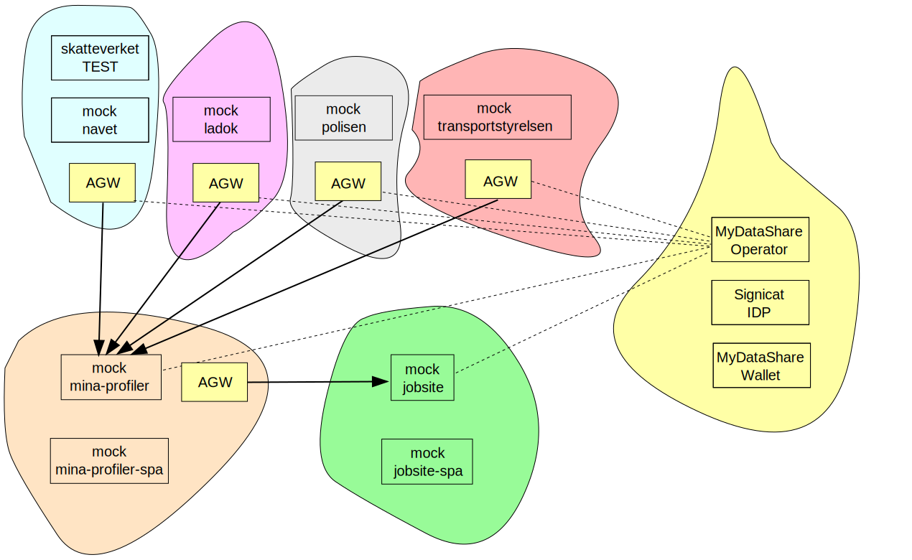

# rupoc
POC for the assignment from the Swedish Government to Arbetsförmedlingen Jobtech to show-case the individuals possibility to take control of her/his own data.

# Case Study
It was decided that the POC should show case a job application process where the individual could import data from some governmental agencies to enrich her/his CV-profile, and to allow an extern (private) job site to fetch that data and show it to an employer representative.

In the POC four data points were selected, residing at four different government agencies. Official address information from Skatteverket, study certificates from Ladok, an excerpt from the individuals criminal record from Polisen (to be used for job applications where this is mandatory - kondergarden etc), and driver license information from Transportstyrelsen. (The criminal record excerpt was later removed from the POC due to secrecy and current legislation reasons).

Two different architectures were found that we wanted to evaluate, a MyData based system where the individual could consent the usage of her/his data through a MyData Operator and its Wallet implementation, and a system based on a SOLID implementation where the individuals data were imported in a (hosted) personal data store PDS and could be shared at the users will.

# MyData implementation
To show case the MyData variant of the implementation a MyData solution were chosen from Vastuu group in Finland. Its (cloud hosted) MyData Share product offered an integrated system with single sign on (SSO) implementation from Signicat and the possibility to log in with swedish test BankId clients. The product also contained a Wallet where the individual could control the sharing of her/his data through consents, and the MyData Share Access Gateway AGW that were to be deployed in front of the data sources - controlling the access to the data.

The following diagram gives an oversite of the implementation. 

| Repository                                                                                  |
| ------------------------------------------------------------------------------------------- |
| [rupoc](https://github.com/individdata/rupoc)                                               |
| [rupoc-mock-mina-profiler-spa](https://github.com/individdata/rupoc-mock-mina-profiler-spa) |
| [rupoc-mock-mina-profiler](https://github.com/individdata/rupoc-mock-mina-profiler)         |
| [rupoc-mock-navet](https://github.com/individdata/rupoc-mock-navet)                         |
| [rupoc-navet-client](https://github.com/individdata/rupoc-navet-client)                     |
| [rupoc-bankid-client](https://github.com/individdata/rupoc-bankid-client)                   |
| [rupoc-ladok-client](https://github.com/individdata/rupoc-ladok-client)                     |
| [rupoc-mock-ladok](https://github.com/individdata/rupoc-mock-ladok)                         |
| [rupoc-mock-trafikverket](https://github.com/individdata/rupoc-mock-trafikverket)           |
| [rupoc-mock-polisen](https://github.com/individdata/rupoc-mock-polisen)                     |
| [rupoc-mock-jobsite](https://github.com/individdata/rupoc-mock-jobsite)                     |
| [rupoc-infra](https://github.com/individdata/rupoc-infra)                                   |
