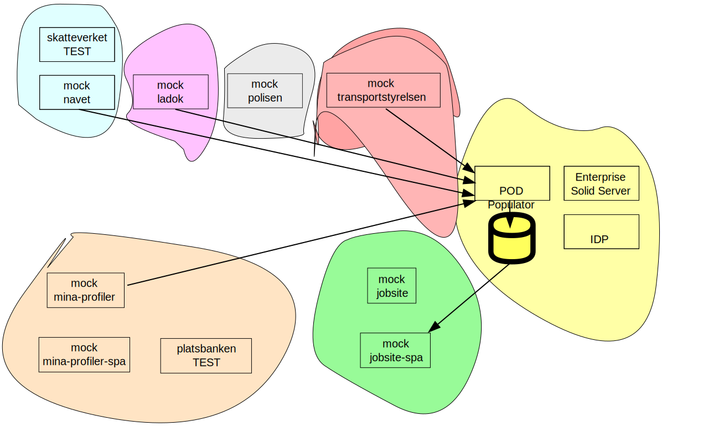

# rupoc
POC for the assignment from the Swedish Government to Arbetsförmedlingen Jobtech to show case the individuals possibility to take control of her/his own data.

# Case Study
It was decided that the POC should show case a job application process where the individual could import data from some governmental agencies to enrich her/his CV-profile, and to allow an extern (private) job site to fetch that data and show it to an employer representative.

In the POC four data points were selected, residing at four different government agencies. Official address information from Skatteverket, study certificates from Ladok, an excerpt from the individuals criminal record from Polisen (to be used for job applications where this is mandatory - kindergarden etc), and driver license information from Transportstyrelsen. (The criminal record excerpt was later removed from the POC due to secrecy and current legislation reasons).

Two different architectures were found that we wanted to evaluate, a MyData based system where the individual could consent the usage of her/his data through a MyData Operator and its Wallet implementation, and a system based on a SOLID implementation where the individuals data were imported in a (hosted) personal data store PDS and could be shared at the users will.

# MyData implementation
For the MyData variant of the POC a solution from Vastuu group in Finland were chosen. Its (cloud hosted) MyData Share product offered an integrated system with a single sign on (SSO) implementation from Signicat and the possibility to log in with Swedish test BankId clients. The product also contained a Wallet where the individual could control the sharing of her/his data through consents, and the MyData Share Access Gateway AGW that were to be deployed in front of the data sources - controlling the access to the data.

The following diagram gives an oversite of the architecture:

Since there were no appropriate test services that could be used we created four mock services for the POC that could serve test data. One of the services, the navet mock service, are backed by a real test service at Skatteverket. (But it also had to be fronted by a mocked service since the MyData Share AGW only could front REST services and the Skatteverke test service is implemented with SOAP).

The Arbetsförmedlingen MinProfil application were mocked so it could show the creation of enriched CV profiles where data from the four mocked data sources could be fetched. In this case the back end mina-profiler mock service acted as a data using service from the MyData Shares point of view. The application were divided into a database backed backend and a frontend single page application for user interaction. Integration with MyData Share for login were done in the frontend code, and the backend had to be registered as a data using service and integratied with MyData Share to obtain rights to fetch and process information through the access gateways from the mock services.

The mina-profiler backend were also registered as a data source offering CV profiles as data, and it's export service is fronted by an access gateway.

Also an example Jobsite were mocked, implemented as a database backed backend and a frontend single page application. The Jobsite is registered as a data using service so the user can chose one of her/his CV profiles and make it accessible for the jobsite when applying for a job. The access of the chosen CV profile is being consented through the MyData Share Wallet, and can be tied to a specific job application and thereby available to be shown to enployer representatives.

Four usage scenarions were defined that the system should implement:
1. Editing CV Profile and import data (applicant)
2. Job application (applicant)
3. Check job applications (employer representative)
4. Check job application after consent being revoked (applicant, employer representative)

The creation, editing and importing of data to the CV profile is being done though the mina-profiler-spa web application.

The job application scenario is initiated when the user visits the Arbetsförmedlingen Platsbanken TEST web site and the user choses to apply for a job, (that has been specifically registered as a rupoc test advert so the user is being redirected to the mocked jobsite-spa).

The checking of job applications is done through the jobsite-spa webapplication.

Before the last scenario the appclicant test user have to withdraw its consent, and that is being done through the Wallet.

# SOLID implementation
For the SOLID version of the POC an implentation from Inrupt were chosen by their Enterprise Solid Server ESS. They offered a cloud hosted Personal Data Store PDS where the users data could be stored and later retrieved by parties given appropriate consent and access permissions.

Since couldn't start the implementation of the SOLID version until the end of the time frame given only a subset of the usage scenarios could be implemented. The work were thus focused to the later part of the job seeking use case, where the individual give access to her/his CV profile for an employer representative to read. The collection and importing of the users uwn data from the different government agancies were done ahead of time with a mocked import utility offered by Inrupt.

Since the SOLID solution is focused around the data being stored in the POD, a considerable amount of time were spent to define the RDF structures and schema for the CV profile data and the data from the mocked data sources. This work was essentially done by Inrupt.

For the integration part most of the cource code from the MyData version of the POC could be re-used, and only the jobsite-spa had to be intrgrated to the Enterprose Solid Server via client side (javascript) libraries for login and consenting.

The following diagram gives an oversite of the architecture:

In the SOLID case three of the usage scenarions were implemented:
1. ~~Editing CV Profile and import data (applicant)~~
2. Job application (applicant)
3. Check job applications (employer representative)
4. Check job application after consent being revoked (applicant, employer representative)

The BankId test login was implemented via an IDP integration by Inrupt, so after the test applicant goes to the Arbetsförmedlingen Platsbanken TEST and apply for the test advert, the user is being redirected to the Jobsite where she/he is being prompted to log in and to give her/his consent to show the selected CV Profile for the employer representative. The CV profile being fetched from the users POD. (The use case were hard coded since the implementation needed the WebID for the specific user to consent to).

For scenario 3 the employer representative (with the hard coded WebId) logs into the Jobsite and checks the job application for the test advert.

In the beginning of scenario 4 the applicant has to revoke her/his consent. In the POC SOLID implementation this is done with the POD Populator. The test user logs in to the populator and selects the (imported) CV Profile that was shared (by the jobsite-spa mock implementation in scenario 2), and revokes the consent for the employer representative to read the CV Profile. The employer representative logs into the Jobsite and tries to fetch the CV Profile for the application but is presented with an error page. (That the consent was revoked).

# Repositories
| [rupoc](https://github.com/individdata/rupoc)                                                        | this repository                                      |

| Mocked services and client libraries                                                                 | Info                                                 |
| ---------------------------------------------------------------------------------------------------- | ---------------------------------------------------- |
| [rupoc-mock-navet](https://github.com/individdata/rupoc-mock-navet)                                  | skatteverket address information mock                |
| [rupoc-navet-client](https://github.com/individdata/rupoc-navet-client)                              | SOAP client library to access the navet test service |
| [rupoc-mock-ladok](https://github.com/individdata/rupoc-mock-ladok)                                  | ladok study certificates mock service                |
| [rupoc-ladok-client](https://github.com/individdata/rupoc-ladok-client)                              | ladok mock client                                    |
| [rupoc-mock-transportstyrelsen](https://github.com/individdata/rupoc-mock-transportstyrelsen)        | transportstyrelsen driver license mock service       | 
| [rupoc-mock-polisen](https://github.com/individdata/rupoc-mock-polisen)                              | polisen criminal excerpt mock service                |

| Mocks applications                                                                                   | Info                                                 |
| ---------------------------------------------------------------------------------------------------- | ---------------------------------------------------- |
| [rupoc-mock-mina-profiler-spa](https://github.com/individdata/rupoc-mock-mina-profiler-spa)          | the mina profiler mock SPA frontend application      |
| [rupoc-mock-mina-profiler](https://github.com/individdata/rupoc-mock-mina-profiler)                  | the mina profiler mock backend application           |
| [rupoc-mock-jobsite-spa](https://github.com/individdata/rupoc-mock-mina-profiler-spa)                | the jobsite mock SPA frontend application            |
| [rupoc-mock-jobsite](https://github.com/individdata/rupoc-mock-jobsite)                              | the jobsite mock backend application                 |

| Helpers                                                                                              | Info                                                 |
| ---------------------------------------------------------------------------------------------------- | ---------------------------------------------------- |
| [rupoc-bankid-client](https://github.com/individdata/rupoc-bankid-client)                            | a client library for stand alone BankId integration  |
| [rupoc-infra](https://github.com/individdata/rupoc-infra)                                            | deployment scripts for OpenShift test deployment     |
